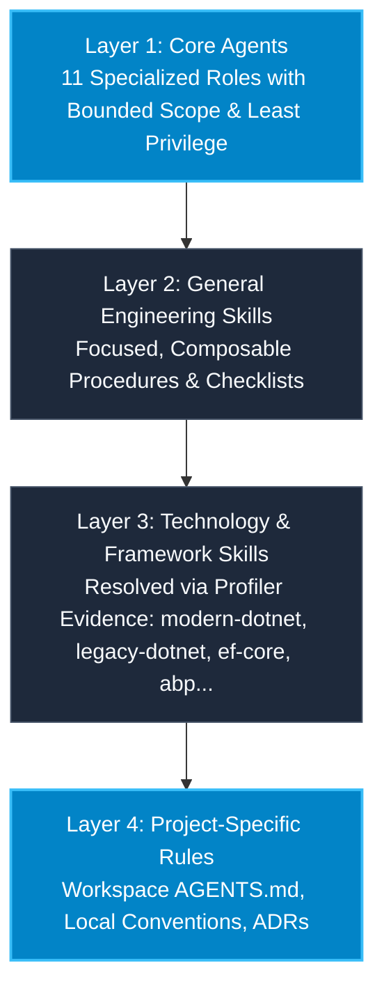

# Universal .NET AI Core Team for Google Antigravity

[](VERSION)
[](https://antigravity.google)
[](docs/architecture.md)
[](LICENSE)

A reusable, progressive, and technology-agnostic AI engineering organization designed natively for **Google Antigravity** (IDE and Desktop 2.0).

Unlike rigid single-prompt assistants, the Universal .NET AI Core Team operates seamlessly across heterogeneous .NET codebases—ranging from **legacy .NET Framework 4.x (MVC 5, Web API 2, EF6, WCF, `web.config`)** to **modern .NET 8/10 (ASP.NET Core, EF Core, Native AOT, ABP Framework)**—without rewriting agents for each new project.

---

## Table of Contents

1. [Key Features](#key-features)
2. [Architecture Overview](#architecture-overview)
3. [The Core Team Roster](#the-core-team-roster)
4. [Installation & Setup](#installation--setup)
   - [Global Installation (All Workspaces)](#global-installation-all-workspaces)
   - [Workspace Installation (Project-Scoped)](#workspace-installation-project-scoped)
   - [Environment Health Check (`doctor.ps1`)](#environment-health-check-doctorps1)
5. [How Project Profiling Works](#how-project-profiling-works)
6. [Dynamic Technology & Skill Resolution](#dynamic-technology--skill-resolution)
7. [Subagent Collaboration & Parallel Execution](#subagent-collaboration--parallel-execution)
8. [Extensibility Guide](#extensibility-guide)
   - [Adding a New Technology Pack](#adding-a-new-technology-pack)
   - [Adding a New Custom Agent](#adding-a-new-custom-agent)
   - [Adding a New Skill](#adding-a-new-skill)
9. [Validation & Automated Testing](#validation--automated-testing)
10. [Legacy Safety Model (Maintenance $\ne$ Migration)](#legacy-safety-model-maintenance--migration)

---

## Key Features

* **Zero Prompt Monoliths**: Core agents remain lean and technology-agnostic at the role level. All framework-specific rules live in modular skills loaded only when relevant.
* **Progressive Disclosure**: Only skill frontmatter (`name`, `description`) is injected into the initial context. Full execution instructions and bulky reference materials are fetched on demand.
* **Authoritative Project Profiler**: Discovers actual repository tech stacks from real metadata (`*.csproj`, `packages.config`, `global.json`, `Directory.Build.props`, etc.)—never guesses from directory names or class conventions.
* **Precedence-Driven Rules**: Project-specific rules override framework rules, which override technology rules, which override general engineering principles. Core correctness and security invariants are never weakened.
* **Independent Severity-Based Review**: Built-in `code-reviewer` operates independently from the implementer, prioritizing defects into P0 (Correctness/Security), P1 (Architecture/Data/Concurrency), P2 (Performance/Maintainability), and P3 (Style).
* **Built-in Least Privilege**: Read-only discovery agents, bounded write implementers, and non-mutating reviewers prevent accidental collateral modifications.

---

## Architecture Overview

The system is organized into **four conceptual layers**:



---

## The Core Team Roster

The team consists of **11 specialized agents**, each with a strictly defined role, clear input/output contracts, and least-privilege tool profiles:

1. **Tech Lead / Orchestrator (`tech-lead`)**: Central workflow coordinator. Plans tasks, delegates to specialists, manages dependencies, aggregates results, and enforces quality gates.
2. **Project Profiler (`project-profiler`)**: Strictly read-only agent. Scans repository configuration to authoritatively detect runtime, framework, ORM, architecture, and dependencies.
3. **Software Architect (`architect`)**: Analyzes solution architecture, enforces inward dependency rules (Clean Architecture, DDD, Vertical Slice), and authors Architecture Decision Records (ADRs).
4. **.NET Engineer (`dotnet-engineer`)**: Primary implementation specialist. Writes idiomatic, version-compliant C# across all supported .NET runtimes.
5. **Database Engineer (`database-engineer`)**: Manages data access layers (EF Core, EF6, Dapper, ADO.NET), query optimization (`AsNoTracking`, `AsSplitQuery`), migrations, and transaction boundaries.
6. **Test Engineer (`test-engineer`)**: Designs and implements task-driven testing strategies across the test pyramid (unit, integration, WebApplicationFactory, regression).
7. **Security Engineer (`security-engineer`)**: Audits code for vulnerabilities (OWASP Top 10, AuthN/AuthZ, CSRF, SSRF, SQLi, secrets exposure, multi-tenant data leaks).
8. **Performance Engineer (`performance-engineer`)**: Conducts empirical performance analysis (memory allocations, N+1 queries, async deadlocks, thread pool starvation).
9. **Migration Engineer (`migration-engineer`)**: Executes staged, incremental migrations (.NET Framework $\rightarrow$ modern .NET, EF6 $\rightarrow$ EF Core). Enforces *Migration $\ne$ Rewrite*.
10. **Legacy Analyst (`legacy-analyst`)**: Strictly read-only reverse engineer. Analyzes legacy or undocumented systems and builds architectural and risk maps.
11. **Code Reviewer (`code-reviewer`)**: Independent review agent. Evaluates all proposed diffs against severity levels (P0-P3) and issue categories (`BUG`, `RISK`, `IMPROVEMENT`, `STYLE`).

---

## Installation & Setup

### Global Installation (All Workspaces)

To make the Universal .NET AI Core Team available across all projects on your machine, install it into your global Antigravity configuration directory (`~/.gemini/config/`):

```powershell
powershell -ExecutionPolicy Bypass -File scripts/install-global.ps1
```

This copies the core agents, skills, and rules into `~/.gemini/config/.agents/`, making them discoverable in any repository.

### Workspace Installation (Project-Scoped)

To bundle the Core Team directly into a specific project repository (for VCS commit and team-wide sharing):

```powershell
powershell -ExecutionPolicy Bypass -File scripts/install-workspace.ps1 -TargetPath "C:\Path\To\YourProject"
```

This creates `.agents/` inside the target project, containing:
* `.agents/agents/`
* `.agents/skills/`
* `.agents/rules/`
* `AGENTS.md`

### Environment Health Check (`doctor.ps1`)

To verify that your Antigravity environment is properly configured:

```powershell
powershell -ExecutionPolicy Bypass -File scripts/doctor.ps1
```

---

## How Project Profiling Works

Before any code modification or specialist delegation, the **Project Profiler** inspects repository metadata files:

* Solutions: `*.sln`, `*.slnx`
* Project files: `*.csproj`, `Directory.Build.props`, `Directory.Build.targets`, `Directory.Packages.props`
* Version manifests: `global.json`, `packages.config`, `web.config`
* Package references: NuGet dependencies and versions, ABP module packages
* UI & container manifests: `package.json`, `tsconfig.json`, `Dockerfile`, `docker-compose.yml`

The profiler outputs two authoritative, machine-readable artifacts into the repository root:
1. `.project-context.json`: Structured JSON containing detected runtime, framework, ORM, database, architecture, and legacy indicators.
2. `.project-context.md`: Human-readable markdown summary for developers and agents.

---

## Dynamic Technology & Skill Resolution

The Core Team dynamically resolves skills based on the output of the Project Profiler:

```text
[Repository Metadata]
         ↓
[Project Profiler] → Generates .project-context.json
         ↓
[Skill Resolver] → Matches detected stack to Technology Skills
         ↓
[Tech Lead] → Injects matching skills into Specialist subagent
         ↓
[Specialist Execution]
```

### Resolution Examples

* **Legacy .NET Framework**: `.NET Framework 4.8` + `MVC 5` + `EF6`
  $\rightarrow$ Resolves: `legacy-safety-guard`, `sql-safety`, `csharp-idioms (C# 7.3)`
* **Modern .NET**: `.NET 8` + `ASP.NET Core` + `EF Core`
  $\rightarrow$ Resolves: `ef-diagnostics`, `csharp-idioms (C# 12)`, `error-handling-result`, `test-pyramid`
* **Enterprise ABP**: `.NET 9` + `ABP Framework` + `EF Core`
  $\rightarrow$ Resolves: `clean-boundaries`, `ef-diagnostics`, `secure-by-default`

---

## Subagent Collaboration & Parallel Execution

The Tech Lead orchestrates specialist agents using strict dependency ordering:

* **Independent Investigation Tasks (Can Run in Parallel)**:
  * Architecture Analysis + Database Audit + Security Audit
* **Implementation Tasks (Must Run Sequentially)**:
  * `architect` (Plan) $\rightarrow$ `dotnet-engineer` (Code) $\rightarrow$ `test-engineer` (Test) $\rightarrow$ `code-reviewer` (Review)

### Handoff Protocol Contract

All agent handoffs utilize a structured markdown contract:
```text
STATUS: READY | BLOCKED | FAILED
SUMMARY: <brief explanation>
FINDINGS:
  - <empirical observations>
FILES_INSPECTED:
  - <link to file>
CHANGES:
  - <link to file>: <surgical modification description>
TESTS:
  - <command>: <result>
RISKS:
  - <potential side effects>
DECISIONS:
  - <architectural rationale>
RECOMMENDATION: <actionable next step>
NEXT_AGENT: <specialist-name>
```

---

## Extensibility Guide

### Adding a New Technology Pack

Technology Packs encapsulate framework-specific knowledge without polluting core agent definitions. To add a new pack (e.g., `modern-dotnet`, `abp`, `ef-core`):

1. Create a directory under `.agents/skills/<technology-pack-name>/`.
2. Provide a standard `SKILL.md` with YAML frontmatter:
   ```markdown
   ---
   name: abp-framework
   description: Use when working in ABP Framework solutions for DDD modules, permissions, and repositories.
   ---
   ```
3. Add supporting documentation under `references/` and execution scripts under `scripts/`.
4. Register the pack in the Technology Resolution table in `docs/routing.md`.

### Adding a New Custom Agent

1. Create a directory under `.agents/agents/<agent-name>/`.
2. Define `agent.md` specifying:
   * Role, Purpose, Scope, and Non-Responsibilities
   * Tool Permissions (Least Privilege)
   * Progressive Skills list
   * Input/Output Contract
3. Run `python scripts/validate.py` to verify frontmatter, tool bounds, and token limits.

### Adding a New Skill

1. Scaffold using standard structure:
   ```text
   .agents/skills/<category>/<skill-name>/
   ├── SKILL.md
   ├── references/
   └── scripts/
   ```
2. Keep `SKILL.md` under 400 lines (progressive disclosure). Place detailed technical manuals in `references/`.

---

## Validation & Automated Testing

The Core Team includes an automated validation suite:

```bash
# Run integrity validation (frontmatter, links, circular handoffs, permissions)
python scripts/validate.py

# Run test fixtures and routing scenario tests
pytest tests/
```

### Included Test Fixtures

1. **Fixture 1**: .NET Framework 4.8 + ASP.NET MVC 5 + EF6 (`web.config`, `packages.config`).
2. **Fixture 2**: .NET 8 + ASP.NET Core Web API + EF Core (nullable enabled, Minimal APIs).
3. **Fixture 3**: .NET 10 + Modern C# 13 + Native AOT.
4. **Fixture 4**: ABP Framework v9.x + ASP.NET Core + EF Core (Domain, Application, HttpApi).
5. **Fixture 5**: ASP.NET Core + Dapper + SQL Server (raw SQL, connection pooling).
6. **Fixture 6**: Mixed Legacy Solution (.NET 4.7.2 WCF + .NET Standard 2.0 + .NET 8).

---

## Legacy Safety Model (Maintenance $\ne$ Migration)

When working on legacy .NET Framework applications, agents are governed by strict safety rules:

* **DO NOT** convert synchronous code to `async/await` everywhere (prevents thread pool starvation and synchronization context deadlocks).
* **DO NOT** replace `web.config` or `packages.config` with modern equivalents unless migrating.
* **DO NOT** replace WCF, ASMX, or OWIN with gRPC or ASP.NET Core middleware during maintenance tasks.
* **DO NOT** introduce modern DI containers or architectural rewrites without explicit user authorization.
* **DO** preserve existing conventions, static helpers, and legacy database access patterns.
