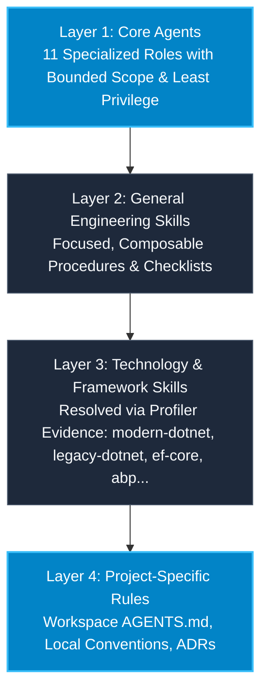

# Architecture & System Design

The **Universal .NET AI Core Team** is architected to solve the multi-repository scaling challenge for AI coding assistants. Instead of creating a separate, bespoke AI team for every project or polluting agent prompts with an overwhelming catalog of .NET frameworks, the system employs a **4-Layer Decoupled Hierarchy** with dynamic skill resolution and least-privilege tool execution.

---

## 1. The 4-Layer Hierarchy

### Layer 1: Core Agents
Eleven specialized roles (Tech Lead, Project Profiler, Software Architect, .NET Engineer, Database Engineer, Test Engineer, Security Engineer, Performance Engineer, Migration Engineer, Legacy Analyst, Code Reviewer). These agents are technology-agnostic at the role and workflow level.

### Layer 2: General Engineering Skills
Reusable, framework-agnostic engineering skills (`evidence-first`, `minimal-change`, `clean-boundaries`, `secure-by-default`, `test-pyramid`, `allocation-profiling`).

### Layer 3: Technology & Framework Skills (Technology Packs)
Framework-specific procedural knowledge loaded on demand based on empirical repository profiling (`legacy-safety-guard`, `csharp-idioms`, `ef-diagnostics`, `sql-safety`, `incremental-upgrade`, and future packs like `abp-framework`, `aspnet-core`, etc.).

### Layer 4: Project-Specific Rules
Workspace-level instructions declared in `AGENTS.md` or `.agents/rules/` that capture repository-specific conventions, internal library patterns, or team guidelines.

---

## 2. Precedence and Conflict Invariant

When instructions or recommendations conflict during task execution, the system applies the following strict precedence order:
$$\text{Project-Specific Rules (L4)} > \text{Framework-Specific Rules (L3)} > \text{Technology-Specific Rules (L3)} > \text{General Principles (L2)}$$

> [!IMPORTANT]
> **Safety Invariant**: Project-specific rules must **never** silently weaken fundamental security or correctness requirements (e.g. bypassing SQL parameterization, ignoring concurrency invariants, or disabling authentication). When a project convention conflicts with core security or correctness, the agent must halt, document the conflict, and report it explicitly.

---

## 3. Tool Permission & Least-Privilege Model

Each agent operates under a restricted tool profile to prevent accidental modifications:

| Agent | Read / Search | Write / Edit Code | Run Tooling / Commands | Schedule / Orchestration |
| :--- | :---: | :---: | :---: | :---: |
| `tech-lead` | Yes | No | Limited | Yes |
| `project-profiler` | **Yes** | **NO** | **NO** | No |
| `architect` | Yes | Docs only | No | No |
| `dotnet-engineer` | Yes | Yes | Build / Test | No |
| `database-engineer` | Yes | Data layer only | EF Tooling | No |
| `test-engineer` | Yes | Test files only | Test runner | No |
| `security-engineer` | **Yes** | **Docs only** | No | No |
| `performance-engineer` | Yes | Docs only | Diagnostics | No |
| `migration-engineer` | Yes | Yes | Build / Test | No |
| `legacy-analyst` | **Yes** | **NO** | **NO** | No |
| `code-reviewer` | **Yes** | **NO** | Test runner | No |
